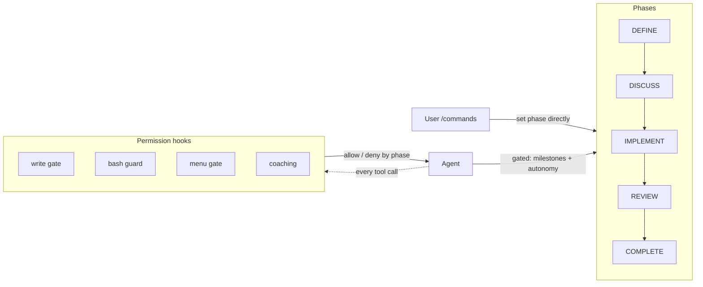

# Workflow Manager for Claude Code

[](https://www.gnu.org/licenses/gpl-3.0)

A Claude Code plugin that enforces a phased engineering workflow on AI coding
sessions: think before coding, review before shipping. Enforcement is
mechanical — permission hooks block the tool calls, so the workflow holds even
when prompt instructions would not.

## Why

Model capability improves with every release, and prompt instructions written
for one model quietly lose effect on the next. Independent of capability, a
coding session:

- Writes code before a plan exists — nothing prevents it
- Loses context over long sessions; early decisions drift
- Retains nothing between sessions — decisions, attempts, and rejections are
  lost when the session ends
- Provides no signal about which of its instructions still change behavior

Our pressure tests ([evals](evals/README.md)) showed the current model passing
checks its prompts were written to enforce. The durable value of a workflow
system is what a model cannot provide for itself:

| Capability | Mechanism | Where |
|---|---|---|
| **Enforcement** | PreToolUse hooks block writes until a plan is approved; phase gates order the work | [`plugin/hooks/`](plugin/hooks/), [`plugin/phases/`](plugin/phases/) |
| **Structure** | Six phases; plan and spec artifacts; PR and issue templates with required fields | [`plugin/phases/`](plugin/phases/), [`.github/`](.github/) |
| **Memory** | Cross-session observations (claude-mem); issue-first tracking | [Hooks reference](docs/reference/hooks.md) |
| **Measurement** | Eval fixtures that pressure-test every agent-prompt rule against the bare model | [`evals/`](evals/README.md) |

**Operating principle:** every instruction must earn its place. We test the
model without it; the instruction stays only if the model fails. When the
model changes, we test again. Decision record:
[WFM positioning](docs/spikes/wfm-positioning.md).

## Architecture



- **Phases** — DEFINE and DISCUSS block file writes (research and planning
  only); IMPLEMENT and REVIEW allow them; COMPLETE re-restricts to docs and
  state. Each phase has an exit gate over its milestones.
- **Hooks** — `PreToolUse` hooks read the phase from a JSON state file and
  deny out-of-phase writes. A `UserPromptSubmit` guard blocks dangerous shell
  input. `PostToolUse` hooks coach (three layers, throttled) and tag fetched
  web content as untrusted data. Full detail:
  [WFM architecture](plugin/docs/reference/wfm-architecture.md) — including
  the trust model and its documented gaps.
- **Review** — the REVIEW phase dispatches 5 reviewer agents in parallel plus
  a verifier; COMPLETE runs validators with bounded fix loops.
- **Autonomy** is orthogonal to phase: `off` (step-by-step), `ask` (free
  within a phase, stops at boundaries), `auto` (unattended, forward-only
  transitions). `auto` never survives a session boundary — a new session
  downgrades it to `ask`.

| Phase | Edits | What happens |
|-------|-------|--------------|
| **OFF** | Allowed | No enforcement |
| **DEFINE** | Blocked | Frame the problem, define outcomes |
| **DISCUSS** | Blocked | Research approaches, write plan |
| **IMPLEMENT** | Allowed | Execute plan with TDD |
| **REVIEW** | Allowed | Parallel review agents + verification |
| **COMPLETE** | Blocked | Validate outcomes, docs, handover |

Commands: `/define` `/discuss` `/implement` `/review` `/complete` `/off`
`/autonomy` `/proposals` `/debug` `/tks`

## Evals: prompts are code, so they get tests

The repository treats agent prompts as behavior, not documentation. The rule
(["the Iron Law"](CLAUDE.md)): **no agent-prompt edit without a failing test
first.**

- **RED** — run the pressure scenario against the bare agent and capture
  verbatim what it does. If it does not fail, the rule is recorded as
  GREEN-only, with its detection ceiling stated honestly.
- **GREEN** — write only the prompt text that fixes the observed failure.
- **CI** — PRs touching agent prompts re-run those agents' fixtures against
  the live Claude API ([`agent-evals.yml`](.github/workflows/agent-evals.yml)).
  Borderline judge criteria coin-flip while real regressions fail
  deterministically, so a FAIL re-runs best-of-3 before it counts.

The same discipline applies to prose. A two-part judge grades every PR body
and changed Markdown ([`tools/judge/`](tools/judge/)). The **mechanical half**
(sentence budgets, required slots) is the only source of PASS/FAIL, so
identical text always gets identical verdicts. The **model half** produces
recommendations only, never a verdict — adopted after model findings flipped
across rounds on identical text. Judge prompts are pinned; editing one
requires re-running its labeled calibration set
([`tools/judge/calibration/`](tools/judge/calibration/)). Every judge is
advisory: the human is the final arbiter.

Current test surface: 105 shell tests, 9 behavioral eval fixtures, 17 labeled
calibration drafts, 3 CI workflows.

## Installation

Add the marketplace and install:

```
/plugin marketplace add prgazevedo/claude-code-workflows
/plugin install workflow-manager
/reload-plugins
```

To update an existing installation:

```
/plugin marketplace update prgazevedo
/plugin update workflow-manager
/reload-plugins
```

On the next session start, `setup.sh` installs dependencies (superpowers,
claude-mem) if missing, copies slash commands to `.claude/commands/`,
initializes workflow state, and installs the status line. Slash commands
(`/discuss`, `/define`, …) are available from the second session onwards; use
`/workflow-manager:discuss` in the first.

### Optional tools

| Tool | Description | Docs |
|------|------------|------|
| iTerm Launcher | Opens Claude Code in a dedicated iTerm2 window with a project badge | [Launcher](tools/iterm-launcher/) |
| YubiKey signing | FIDO2 hardware key for commit signing and SSH push | [YubiKey setup](tools/yubikey-setup/) |
| Token Saver (`/tks`) | Toggle-based token reduction via RTK, Serena, mcp2cli | [`/tks`](plugin/commands/tks.md) |

## Docs

- [Architecture](docs/reference/architecture.md) — phases, enforcement, gates, milestones
- [WFM architecture & trust model](plugin/docs/reference/wfm-architecture.md) — hooks, state machine, known trust gaps
- [Hooks reference](docs/reference/hooks.md) — hook implementation details
- [Command reference](docs/reference/commands.md) — all commands
- [Plain language rules](conventions/plain-language.md) — the writing standard the judge enforces
- [Professional standards](plugin/docs/reference/professional-standards.md) — behavioral expectations per phase

Spikes — decision records, each closing an open question:

- [Agent prompt form](docs/spikes/agent-prompt-form.md) — persona openers vs procedural content
- [WFM positioning](docs/spikes/wfm-positioning.md) — what a workflow system provides that models cannot

## Sources

### Community projects

- [cc-sessions](https://github.com/GWUDCAP/cc-sessions) — DAIC workflow enforcement; the original inspiration for this project
- [Superpowers](https://github.com/obra/superpowers) — agentic skills framework for Claude Code
- [claude-mem](https://github.com/thedotmack/claude-mem) — cross-session memory MCP server
- [everything-claude-code](https://github.com/affaan-m/everything-claude-code) — agent harness optimization, skills, memory
- [RTK](https://github.com/rtk-ai/rtk) — CLI proxy that reduces LLM token consumption by 60–90%
- [Serena](https://github.com/oraios/serena) — LSP-powered MCP toolkit for semantic code navigation
- [mcp2cli](https://github.com/knowsuchagency/mcp2cli) — converts MCP/OpenAPI servers into CLI commands

### Anthropic

- [Claude Code](https://docs.anthropic.com/en/docs/claude-code/overview) — the AI coding agent this project extends
- [Claude Code Best Practices](https://code.claude.com/docs/en/best-practices) — agentic coding patterns
- [Building Effective Agents](https://www.anthropic.com/research/building-effective-agents) — tool design, evaluation loops
- [Effective Harnesses for Long-Running Agents](https://www.anthropic.com/engineering/effective-harnesses-for-long-running-agents) — session state, progress checkpoints

## Contributing

See [CONTRIBUTING.md](CONTRIBUTING.md).

## License

[GPL v3](LICENSE)
